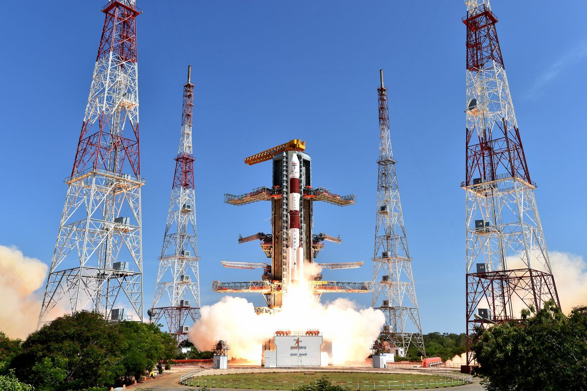
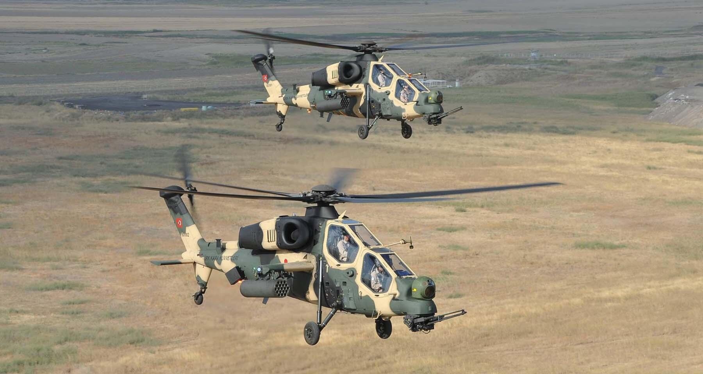
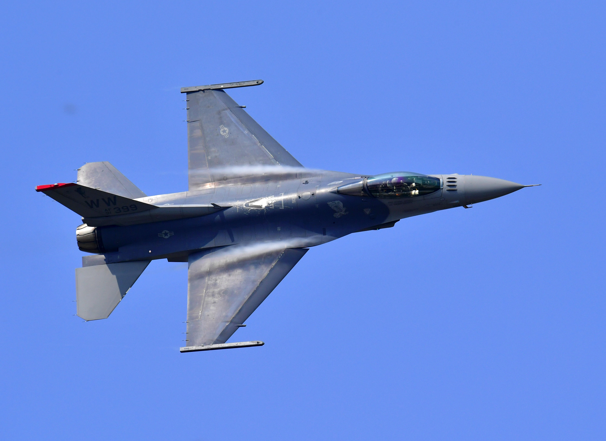

# Air_vehicle_CNN
> Objective: **`What do you use to train an image classifier with our custom image dataset?`**
## ✨Highlight
1.	**Based on pre-trained model,** the highest average accuracy rate is **88.97% of 🏆VGG model**
2.	The best model **after fine tuning pre-trained model is 🏆VGG16**. The average accuracy on test data is at **90.66%** rising from 88.97% (no tune)
3.	InceptionV3  show notable improvement on test accuracy at +15.01%, respectively, while ResNetV2,VGG and MobileNet  have less improvement at +1.94%,1.69% and +1.03%, respectively
4.	Overall, the models have learned a distinctive of each air vehicle type from vehicle shape 

## Table of Contents

 - [1. Introduction🎯](https://github.com/tarrelateto10/Air_vehicle_CNN/blob/main/README.md#1-introduction)
 - [2. Data📑](https://github.com/tarrelateto10/Air_vehicle_CNN#2-data)
 - [3. Network architecture📦](https://github.com/tarrelateto10/Air_vehicle_CNN#3-network-architecture)
 - [4. Training🔮](https://github.com/tarrelateto10/Air_vehicle_CNN#4-training)
 - [5. Results📈](https://github.com/tarrelateto10/Air_vehicle_CNN#5-results)
 - [6. Discussion💭](https://github.com/tarrelateto10/Air_vehicle_CNN/blob/main/README.md#6-discussion)
 - [7. Conclusion📝](https://github.com/tarrelateto10/Air_vehicle_CNN/blob/main/README.md#7-conclusion)
 - [8. References🌐](https://github.com/tarrelateto10/Air_vehicle_CNN/blob/main/README.md#8-references)
 - [Citing](https://github.com/tarrelateto10/Air_vehicle_CNN/blob/main/README.md#citing)

 - [🖇️End Credit ](https://github.com/tarrelateto10/Air_vehicle_CNN/blob/main/README.md#%EF%B8%8Fend-credit)

## 1. Introduction🎯 
- This project aims to test **4 CNN pre-training models** (`VGG16`, `ResNet50V2`, `InceptionV3`, `MobileNet`) on the ImageNet dataset and fine-tune it to classify 3 types of air vehicles ✈️ (`Rocket`, `Passenger-plane`, `Helicopter`, `Fighter-jet`, `Drone`) which is our custom image dataset that were never trained on. 
- Then, we will compare performance of **4 CNN pre-training models** without transfer learning and with transfer learning (Fine-tuning).
- Finally, we use [**`Grad-CAM`**](https://github.com/tarrelateto10/DADS7202_HW02-CNN_MNLP_Group/blob/main/README.md#-visualizing-what-cnn-learned-with-grad-cam4) technique to debug the model and gain more insight into what a trained CNN did.

## 2. Data📑
There are many Air Vehicles<sup>0</sup> varieties in Thailand and each one of them has different characteristics. Let’s find out interesting facts about different varieties of air vehicle before training and finetuning models.

✈️ **1. Rocket

  

✈️ **2. Passenger-plane

  

✈️ **3. Helicopter

  

✈️ **4. Fighter-jet
  

✈️ **5. Drone

  

- Total 2500 images (500 images per 1 class)

| Class | Name               | No. of image |
|:---:|---|---:|
|`0`      | Rocket | 500          |
|`1`      | Passenger-Plane    | 500          |
|`2`      | Helicopter  | 500          |
|`3`      | Fighter-jet  | 500          |
|`4`      | Drone  | 500          |
|       | **Total**             | **2500**          |

#### 📍Data source: 
- We download from some resource of kaggle 


#### 🧹Data preparation:
- Collecting set of images from the kaggle is a quick and simple method to gather a set of images. Some facts, meanwhile, are not entirely accurate or useful. As a result, we have to manually remove several unnecessary images from the collection 


#### Data pre-processing
- Firstly, generate images as in .npy before flow those image into the model
- The set of images were rescaled to 224x224 pixels and normalized by the ImageDataGenerator class with **`Pixel Standardization`** technique (zero mean and unit variance)

❕ Be careful: The different normalization techniques<sup>5</sup> effect the model's performance. (Loss and Accuracy).
- We use **`➕Data Augmentation`** technique to increase the diversity of our training set by applying **`ImageDataGenerator`** 
- We apply various changes to the initial data. For example, image rotation, zoom, shifting and fliping

```
        width_shift_range = 5.0,   
        height_shift_range = 5.0,              
        rotation_range=10,                               
        zoom_range=0.2,
        horizontal_flip=True,                 
        vertical_flip=True,
        validation_split=0.3
```


#### ✂️Data splitting (train/val/test):
- `test_size` = 0.8
- `validation_split` = 0.3
- `Splite data Train:Test` = 80:20

## 3. Network architecture📦
### Pre-training Models 
In this experiment, we have selected 4 Pre-training Models for fine-tuning with [**IMAGENET**](https://deeplearning.cms.waikato.ac.nz/user-guide/class-maps/IMAGENET/)<sup>6</sup> dataset as weight

#### [Pre-training model Infomation](https://keras.io/api/applications/)<sup>7</sup>

#### Network Architecture of Pre-training model 
- To compare Network architecture of Pre-training model **`without Fine-tuning`**  VS **`with Fine-tuning`**
- Remark: Based on our dataset and our experiment scope


## 4. Training🔮

- From the experiment, We fine-tune each pre-training model with Hyperparameter more than 50 times to find the best model's performance with highest accuracy, less loss and not over-fit.
- Our training strategy is...


## 5. Results📈
<!-- แสดงตัวเลขผลลัพธ์ในรูปของค่าเฉลี่ย mean±SD โดยให้ทำการเทรนโมเดลด้วย initial random weights ที่แตกต่างกันอย่างน้อย 3-5 รอบเพื่อให้ได้อย่างน้อย 3-5 โมเดลมาหาประสิทธิภาพเฉลี่ยกัน, แสดงผลลัพธ์การ train โมเดลเป็นกราฟเทียบ train vs. validation, สรุปผลว่าเกิด underfit หรือ overfit หรือไม่, อธิบาย evaluation metric ที่ใช้ในการประเมินประสิทธิภาพของโมเดลบน train/val/test sets ตามความเหมาะสมของปัญหา, หากสามารถเปรียบเทียบผลลัพธ์ของโมเดลเรากับโมเดลอื่น ๆ (ของคนอื่น) บน any standard benchmark dataset ได้ด้วยจะยิ่งทำให้งานดูน่าเชื่อถือยิ่งขึ้น เช่น เทียบความแม่นยำ เทียบเวลาที่ใช้train เทียบเวลาที่ใช้ inference บนซีพียูและจีพียู เทียบขนาดโมเดล ฯลฯ 

การแสดงผลลัพธ์เทียบ train vs. validation (เช่น loss, accuracy) ถ้าเป็นไปได้ควรแสดงไว้ในกราฟเดียวกันเพื่อให้สามารถเทียบ scale ค่าผลลัพธ์และดู underfit / overfit ได้ง่าย-->

### 📊 Model Performance Comparison
We pre-train the model with initial random weights in the first round and more 2 rounds without random seed to calculate mean±SD of accuracy and loss on test set as the average of the model performance
In each round, accuracy and loss of test sets are not significantly different. That proves the model is good fit.


#### Accuracy and Loss on Train vs Validation sets


- To compare the highest accuracy on test set of each Pre-training models under the same conditions and the same seeds,


-	The best pre-trained model (No Fine-tune) among the selected models is **`🏆VGG`** with average accuracy rate at **`88.97%`** while after fine tuning it turns out that **`🏆VGG16`** becomes the best model with the highest accuracy on test set at **`90.66%`** from 88.97%
-	After fine-tuning, all selected models show improvement on test accuracy average at **`🔼16.325%`**

### ⌛ Runtime Comparison (on Train set) 
Time per inference step is the average of epoch.
- **`GPU`**: Tesla T4 and RTX3060 TI
- **`Epoch`**: 20


## 6. Discussion💭

-	With ImageDataGenerator(), apart from shift, zoom, rotation and flip, we have tried rescaling with variety methods. Firstly, rescale = 1./255, it shows the worth accuracy rate at about 0.3611 as it just resize pictures by dividing 255. Next, featurewise_center and featurewise_std_normalization which set dataset mean to 0 and normalized over dataset; as a result, accuracy spike to 0.6278. Lastly, samplewise_center and samplewise_std_normalization is similar to the previous method but done over each input. All in all, we chose samplewise_center and samplewise_std_normalization as it shows the higher accuracy rate at 0.7778
-	In the beginning of work, we tried load data with flow_from_directory() that labels of picture will be one-hot encoded i.e. [1 0 0 0] for label number 1; consequently, a loss function must be “CategoricalCrossentropy”. However, we decided to load data with NumPy that labeled data from [0-2] i.e [1] for label number 1. As a result, “SparseCategoricalCrossentropy” is chosen to be the loss function
-	We experience running out of free-access GPU on GoogleColab. So, we try using other accounts, using local GPU on our own computers, and registered for ColabPro since CNN have noticeable difference run-time on CPU and GPU. Execution with CPU roughly takes 40 times of time consuming over GPU (200s vs 5s per epochs)
-	Among learning rate of 0.01, 0.001, 0.0001 and 0.00001, learning rate at 0.001 shows the best accuracy over test data set 
Note: result dementated below is tested with InceptionV3 model


-	Another hyperparameter that affects model accuracy is batch_size, moreover, it varies among models. We use batch_size among 32, 64, and 128
-	We also struggle with random seed, setting fixed random seed at the top does not affect the following codes i.e. accuracy over test set changes as we repeat run. The solution of this is to set seed to all code that available

## 7. Conclusion📝
-	We select 4 pre-trained models; namely, VGG16, MobileNet, ResNetV2, and InceptionV3
-	The best pre-trained model (No Fine-tune) among the selected models is **`VGG`** with average accuracy rate at **`88.97%`** while after fine tuning it turns out that **`VGG`** becomes the best model with the highest accuracy on test set at **`90.66%`** from 84.63%
-	After fine-tuning, all selected models show improvement on test accuracy average at **`16.325%`**
-	The overall run-time among the selected model is 5-6s per epochs under GPU usage

## 8. References🌐

<!-- อ้างอิงไลบรารีที่ใช้ (พร้อมเวอร์ชัน), อ้างอิงเทคนิคที่ยืมมาใช้จากเปเปอร์, อ้างอิงโค้ดหรือรูปภาพที่หยิบยืมมาใช้จาก github หรือจากที่อื่น ๆ -->

### Library
- **`Pandas`**
- **`Numpy`**
- **`Sklearn`**
- **`Keras`**
- **`Matplotlib`**
- **`Seaborn`**
<!-- This content will not appear in the rendered Markdown -->

### Version
```
Python 3.7.15 (default, Oct 12 2022, 19:14:55) 
[GCC 7.5.0]

NumPy 1.21.6

The scikit-learn version is 1.0.2
The Matplotlib version is 3.2.2
The Seaborn version is 0.11.2
TensorFlow 2.9.2
tf.keras.backend.image_data_format() = channels_last
TensorFlow detected 1 GPU(s):
.... GPU No. 0: Name = /physical_device:GPU:0 , Type = GPU
```
<!-- This content will not appear in the rendered Markdown -->

### References

- <sup>1</sup>_-. (2022, Sep 8)._ [**tf.keras.preprocessing.image.ImageDataGenerator**](https://www.tensorflow.org/api_docs/python/tf/keras/preprocessing/image/ImageDataGenerator). TensorFlow.
- <sup>2</sup>_Dustin. (2022, Oct 20)._ [**[Notebooks update] New GPU (T4s) options & more CPU RAM**](https://www.kaggle.com/discussions/product-feedback/361104?fbclid=IwAR2qbmFZTP6BbI7T-hHAAg8ByGiM9cZW_Ik6nHK7-WlRAu8UzoF0R2yCKZY). Kaggle.
- <sup>3</sup>_[fchollet](https://twitter.com/fchollet). (2020, May 12)._ [**Transfer learning & fine-tuning**](https://keras.io/guides/transfer_learning/). Keras.
- <sup>4</sup>_[fchollet](https://twitter.com/fchollet). (2021, March 7)._ [**Grad-CAM class activation visualization**](https://keras.io/examples/vision/grad_cam/). Keras.
- <sup>5</sup>_Jason Brownlee. (2019, Jul 5)._ [**How to Normalize, Center, and Standardize Image Pixels in Keras**](https://machinelearningmastery.com/how-to-normalize-center-and-standardize-images-with-the-imagedatagenerator-in-keras/). Machine Learning Mastery.
- <sup>6</sup>_Lang, Steven and Bravo-Marquez, Felipe and Beckham, Christopher and Hall, Mark and Frank, Eibe. (2019)._ [**IMAGENET 1000 Class List**](https://deeplearning.cms.waikato.ac.nz/user-guide/class-maps/IMAGENET/). Github.
- <sup>7</sup>[**Keras Applications**](https://keras.io/api/applications/). Keras.
- <sup>8</sup>[**Training strategy**](https://www.neuraldesigner.com/learning/tutorials/training-strategy). Neuraldesigner.
- <sup>9</sup>[**Grad-CAM Reveals the Why Behind Deep Learning Decisions**](https://www.mathworks.com/help/deeplearning/ug/gradcam-explains-why.html). Mathworks.

## 🖇️End Credit 
This project is a part of **`CI7310 Deep Learning`**

Term: 1 Year of education: 2023

🎓Master of Science Program in **`Deep Technology and Intelligent Systems`** (CI)

🏫National Institute of Development Administration (**`NIDA`**)